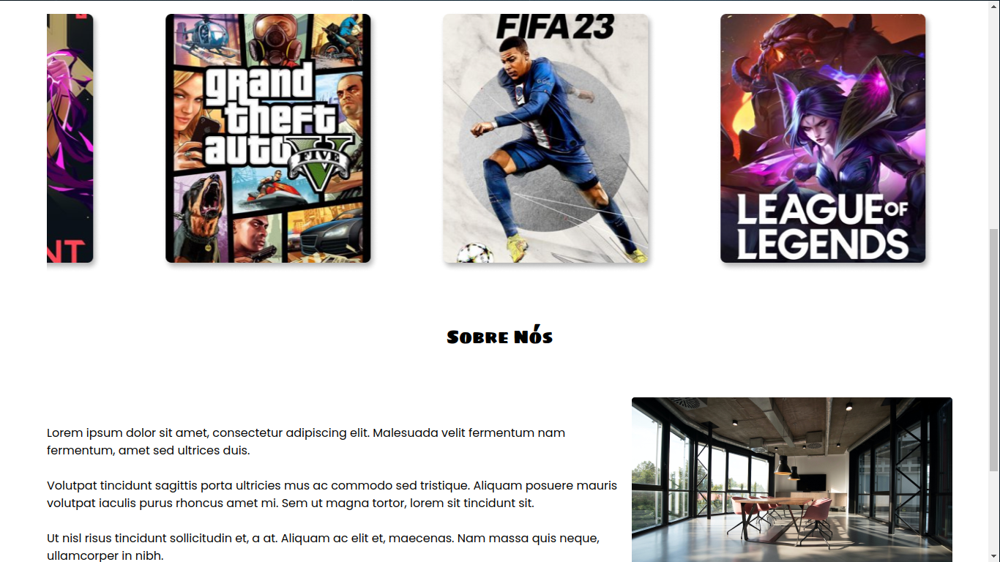

# 🕹️ SandRed


> Site de uma empresa fictícia de games criado para a apresentação de português do curso de Sistemas para Internet.

## 🖥️ Layouts




## 🛠️ Techs

<div>
  
  
  
</div>

## 🛸 Instalação e Execução do projeto

Basta fazer um clone do repositório usando o git:

```bash
git clone https://github.com/LucasAndrade912/sand-red.git
```

Depois de clonar o projeto instale suas dependências com o comando:

```bash
npm install

# or

yarn install
```

E finalmente rode o comando `npm run dev` ou `yarn dev` e abre o projeto no seu navegador.
